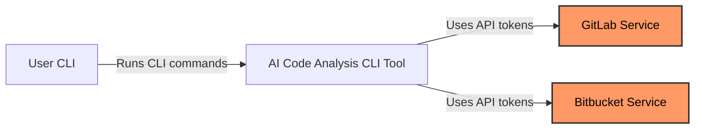
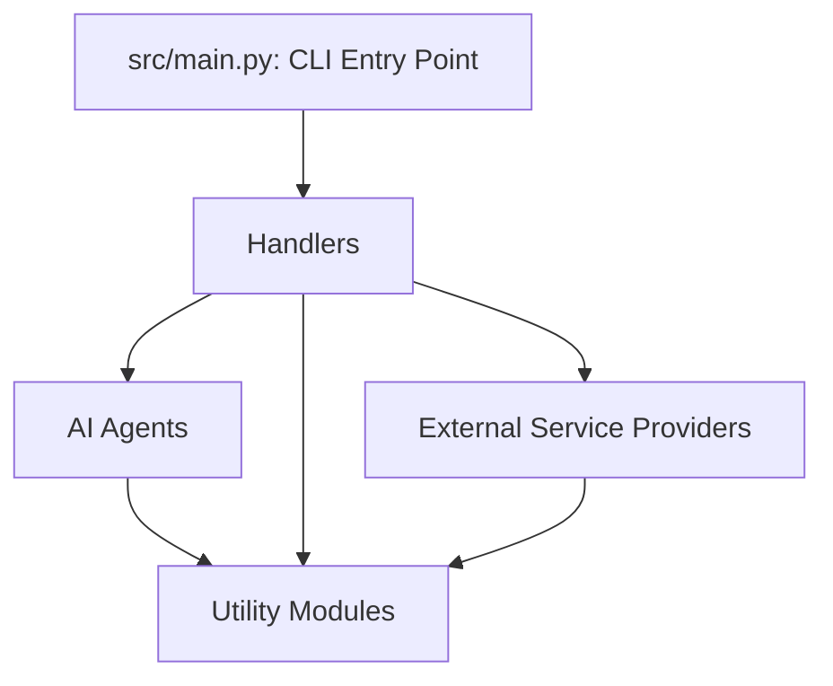

# Project Overview

## Project Title
AI-Powered Code Analysis and Documentation CLI Tool

## Purpose and Main Functionality
This project is a command-line interface (CLI) tool designed to perform asynchronous AI-driven code analysis and documentation generation on software repositories. It automates the process of analyzing codebases, generating detailed markdown reports, and creating merge requests with analysis results on GitLab projects.

## Key Features and Capabilities
- Asynchronous AI-based code analysis using configurable agents.
- README documentation generation with AI assistance.
- Scheduled cronjob support for automated analysis of GitLab projects.
- Integration with GitLab and Bitbucket for repository management.
- Automated merge request creation with analysis results.
- Robust retry and error handling mechanisms.
- Configurable via CLI flags and YAML configuration files.
- Structured logging and telemetry support.

## Likely Intended Use Cases
- Continuous code quality and architecture analysis in CI/CD pipelines.
- Automated documentation generation for code repositories.
- Scheduled repository health checks and analysis in GitLab groups.
- Integration with GitLab workflows to automate merge requests with AI insights.

---

# Table of Contents

- [Project Overview](#project-overview)
- [Architecture](#architecture)
- [C4 Model Architecture](#c4-model-architecture)
- [Repository Structure](#repository-structure)
- [Dependencies and Integration](#dependencies-and-integration)
- [API Documentation](#api-documentation)
- [Development Notes](#development-notes)
- [Known Issues and Limitations](#known-issues-and-limitations)
- [Additional Documentation](#additional-documentation)

---

# Architecture

## High-level Architecture Overview
The system is a modular CLI tool that orchestrates AI-driven code analysis and documentation generation workflows. It separates concerns into distinct components: CLI entry point, handlers for command processing, AI agents for analysis and documentation, providers for external service integration, and utility modules for shared functionality.

## Technology Stack and Frameworks
- Python 3.10+
- Asynchronous programming with asyncio
- Pydantic for configuration and data validation
- GitPython for git operations
- Python-GitLab and REST API clients for GitLab and Bitbucket integration
- Jinja2 for prompt templating
- OpenTelemetry and Langfuse for telemetry and tracing
- HTTPX and Tenacity for resilient HTTP client with retry logic

## Component Relationships

```mermaid
flowchart TB
  subgraph CLI
    direction TB
    CLI[src/main.py: CLI Entry Point]
  end

  subgraph Handlers
    direction TB
    AnalyzeHandler[src/handlers/analyze.py]
    ReadmeHandler[src/handlers/readme.py]
    JobAnalyzeHandler[src/handlers/cronjob.py]
  end

  subgraph Agents
    direction TB
    AnalyzerAgent[src/agents/analyzer.py]
    DocumenterAgent[src/agents/documenter.py]
  end

  subgraph Providers
    direction TB
    GitLabProvider[src/providers/gitlab.py]
    BitbucketProvider[src/providers/bitbucket.py]
  end

  subgraph Utils
    direction TB
    Logger[src/utils/logger.py]
    PromptManager[src/utils/prompt_manager.py]
    RetryClient[src/utils/retry_client.py]
  end

  CLI -->|Dispatch commands| Handlers
  Handlers -->|Invoke| Agents
  Handlers -->|Use| Providers
  Agents -->|Use| Utils
  Handlers -->|Use| Utils
  Providers -->|Use| Utils

  classDef cli fill:#f9f,stroke:#333,stroke-width:2px
  class CLI cli

  classDef handler fill:#bbf,stroke:#333,stroke-width:2px
  class Handlers handler

  classDef agent fill:#bfb,stroke:#333,stroke-width:2px
  class Agents agent

  classDef provider fill:#fbf,stroke:#333,stroke-width:2px
  class Providers provider

  classDef util fill:#ffb,stroke:#333,stroke-width:2px
  class Utils util
```

## Key Design Patterns
- Factory pattern for provider instantiation based on configuration.
- Dependency injection for handlers and providers.
- Asynchronous programming with async/await.
- Template rendering with Jinja2 for prompt management.

---

# C4 Model Architecture

<details>
<summary>Context Diagram</summary>



</details>

<details>
<summary>Container Diagram</summary>



</details>

---

# Repository Structure

- `src/main.py`: CLI entry point and command dispatcher.
- `src/handlers/`: Contains command handlers (`AnalyzeHandler`, `ReadmeHandler`, `JobAnalyzeHandler`).
- `src/agents/`: AI agents implementing analysis and documentation logic.
- `src/providers/`: External service API clients for GitLab and Bitbucket.
- `src/utils/`: Shared utilities such as logging, prompt management, and HTTP client.

---

# Dependencies and Integration

## Internal Dependencies
- Handlers depend on agents and providers.
- Providers depend on HTTP clients and external APIs.
- Utils provide shared services like logging and retry logic.

## External Service Dependencies
- GitLab API for project discovery, repository cloning, branch and merge request management.
- Bitbucket API for repository and pull request management.
- LLM providers (OpenAI, Gemini) for AI-driven analysis and documentation.

---

# API Documentation

## CLI Commands

| Command           | Description                                | Key Parameters                                   | Output                                   |
|-------------------|--------------------------------------------|-------------------------------------------------|------------------------------------------|
| `analyze`         | Runs code analysis on a repository         | `--repo-path` (required), exclude flags for analysis types | Markdown analysis files in `.ai/docs/`  |
| `document`        | Generates README documentation              | `--repo-path` (required), section exclusion flags, `--use-existing-readme` | `README.md` in repository root           |
| `cronjob analyze` | Automated GitLab project analysis and MR creation | `--max-days-since-last-commit`, `--working-path`, `--group-project-id` | Merge requests with analysis results     |

## Request/Response Formats
- Commands accept CLI flags parsed into Pydantic config models.
- Responses are markdown files written to the repository or merge requests created in GitLab.
- Authentication is handled via environment variables for API tokens.

---

# Development Notes

## Project-specific Conventions
- Use Pydantic models for configuration and validation.
- Handlers implement async `handle()` methods.
- Logging via centralized `Logger` utility.
- Prompt templates managed with Jinja2 in YAML files.

## Testing Requirements
- Unit and integration tests should cover handlers, agents, and providers.
- Mock external API calls for GitLab and Bitbucket.

## Performance Considerations
- Asynchronous execution for concurrent analysis.
- Retry logic with backoff for transient errors.

## Cronjob Configuration Options

| Option Name               | Type     | Default                         | Description                                               |
|---------------------------|----------|---------------------------------|-----------------------------------------------------------|
| max_days_since_last_commit | int      | 30                              | Maximum days since last commit to consider a project      |
| working_path              | Path     | /tmp/cronjob/projects           | Path where projects are cloned for cronjob execution      |
| group_project_id          | int      | 3                               | Group ID (GitLab) whose projects will be analyzed         |
| provider                 | str      | gitlab                          | Provider to use for repo operations (gitlab, bitbucket)   |
| source_branch            | str      | None                            | Branch to base the analysis on; falls back to default     |
| target_branch            | str      | None                            | MR/PR target branch; defaults to repository default       |
| bitbucket_project_key    | str      | None                            | Bitbucket only: filter repositories by project key        |
| analyzer_max_retries     | int      | 3                               | Number of retries for analyzer on transient errors        |
| retry_backoff_seconds    | float    | 3.0                             | Seconds to wait between analyzer retries                   |
| enforce_docs             | bool     | True                            | Create placeholder files for missing analysis docs        |

### Usage Examples
```bash
# Run cronjob with default max days since last commit
cronjob analyze --max-days-since-last-commit 10

# Specify working path for cloning projects
cronjob analyze --working-path /var/tmp/projects

# Analyze projects in a specific GitLab group
cronjob analyze --group-project-id 5

# Use Bitbucket provider with project key filter
cronjob analyze --provider bitbucket --bitbucket-project-key AID

# Customize analyzer retry behavior
cronjob analyze --analyzer-max-retries 5 --retry-backoff-seconds 5.0

# Disable placeholder doc creation
cronjob analyze --enforce-docs false
```

### How Options Affect Cronjob Execution
- `max_days_since_last_commit`: Filters out projects with commits older than this threshold to avoid stale analysis.
- `working_path`: Directory where repositories are cloned for analysis.
- `group_project_id`: Limits analysis to projects within a specific GitLab group.
- `provider`: Selects the external service provider for repository operations.
- `source_branch` and `target_branch`: Control the branches used for analysis and merge request creation.
- `bitbucket_project_key`: Filters Bitbucket repositories by project key.
- `analyzer_max_retries` and `retry_backoff_seconds`: Control retry behavior for transient errors during analysis.
- `enforce_docs`: Ensures all expected analysis documents exist by creating placeholders if missing.

---

# Known Issues and Limitations

- Some features are GitLab-specific; Bitbucket support is partial and may require enhancements.
- Manual dependency injection leads to boilerplate wiring.
- No user authentication middleware as this is a CLI tool.
- Potential for improved test coverage and error handling robustness.
- Additional documentation on prompt templates and agent internals would be helpful.

---

# Additional Documentation

- See `.ai/docs/api_analysis.md` for detailed API and integration documentation.
- See `.ai/docs/data_flow_analysis.md` for data lifecycle and transformation details.
- See `.ai/docs/dependency_analysis.md` for module dependency insights.

---

*This README was generated automatically based on code analysis and repository structure.*
